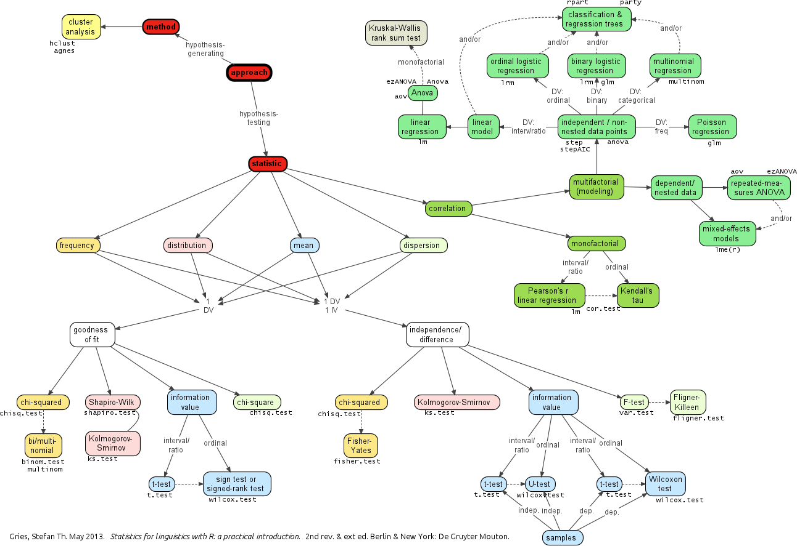

<!-- NOTES: 

- To build the pkgdown site only updating documentation and vignettes that have changed use `pkgdown::build_site(lazy = TRUE)`

-->

```{r setup, include = FALSE}
knitr::opts_chunk$set(
  collapse = TRUE,
  comment = "#>",
  out.width=NULL
)
```

# Speech corpora and sociolinguistics

In @Tottie2011 the spoken components of the British National Corpus were used to investigate the potential sociolinguistics of the usage of the fillers 'uh' and 'um'. It was found that men use more fillers than women and speakers in managerial or higher positions also use more fillers. The results for age are less telling with one clear result being that the oldest cohort used more fillers. Turning to each of the fillers, men used more 'uh' than 'um' and women the opposite. It was also found that when looking at these variants age appeared to predict usage; younger speakers used more 'um' and older speakers more 'uh'. Finally, one somewhat counterintuitive result is that speakers of higher socio-economic status used 'um' more than there lower status counterparts.

The authors focus on British English exclusively and compare both conversational and 'context-governed' spoken language. In this case study, we will look at an American English corpus: [Santa Barbara Corpus of Spoken American English](http://www.linguistics.ucsb.edu/research/santa-barbara-corpus). This corpus is conversational and fortunately includes a rich set of meta data including ages, occupations, genders, years of education, etc.

Using this corpus we will explore the main components of the @Tottie2011 article. That is, to explore the influence of gender, age, and socioeconomic status on the usage of fillers, in general, and then the types of fillers, either 'uh' or 'um'. 

# Data

Let's access a curated version of this data through the `analyzr` package. First, install and load the package, and the main tidyverse tools. 

```{r install-analyzr, eval=FALSE}
devtools::install_github("WFU-TLC/analyzr")
```

```{r libraries}
library(tidyverse)
library(analyzr)
```

Let's take a look at the `sbc` dataset. 

```{r data-first-look}
glimpse(sbc)
```

To find out more about the data we can look at the data dictionary provided in the `analyzr` package with `?sbc`. 

# Case Study

First we will prepare the data by isolating the independent variables of intereest and extracting our dependent variables 'uh' and 'um', add them to the `sbc` data.frame and transform the data.frame to a format more suitable to the visualizations and significance tests that we will be conducting. Second, we will step through 'gender', 'age', and 'socioeconomic class' and visualize and submit the contrasts to the relevant statistical tests.

## Prepare the variables

### Isolate independent variables

Before we continue, let's decide on the column variables we are going to use as proxies for 'gender', 'age' and 'socioeconomic class'. The first two are easy and straight forward. Socioeconomic class is much more tricky, not just for us, but in general. From my knowledge of the sociolinguistic literature and to keep operationalization of this variable simple, I will use `years_edu` as our 'socioeconomic class' proxy.

As promised, we will now get rid of the data that does not have complete data for these three variables. First we select only those variables/ columns in `sbc` of interest with `select()`. Then we use `complete.cases()` to find rows that have data for all of these variables afterwhich we slice the `sbc` data.frame to include only these complete cases.

```{r isolate-indep-vars}
sbc <- sbc %>% select(id, name, gender, age, years_edu, utterance_clean)
sbc <- sbc[complete.cases(sbc), ]
```

### Extract dependent variable

Now we need to count the occurrences of 'uh/um' for each utterance. We will add a column with the counts for each filler type using `str_count()` and then we will change this 'wide' format to 'long' format with `gather()`. That is, we want the fillers to be under one column and the number of each filler to be in a separate column.

```{r extract-dep-var}
sbc <- 
  sbc %>% 
  mutate(um = str_count(utterance_clean, "\\b(um|u=m)\\b")) %>% 
  mutate(uh = str_count(utterance_clean, "\\b(uh|u=h)\\b"))

sbc 

sbc <- 
  sbc %>% 
  gather(filler_type, filler_count, um:uh)

sbc
```

## Analysis

### Gender

The first question to explore here is whether filler or type of filler is predicted by gender differences. In Tottie, it was found that A) men use more fillers than women, but B) women use 'um' more than men. 

To get a sense what our data is doing, let's visualize these contrasts.

```{r gender-viz}
p1 <- 
  sbc %>% 
  ggplot(aes(x = gender, y = filler_count, group = 1)) + 
  geom_smooth(method = "lm") + 
  labs(x = "Gender", y = "Filler count")

p2 <- 
  sbc %>% 
  ggplot(aes(x = gender, y = filler_count, group = filler_type, color = filler_type)) + 
  geom_smooth(method = "lm") + 
  labs(x = "Gender", y = "Filler count", color = "Filler type")

gridExtra::grid.arrange(p1, p2, ncol = 2)
```

Visually, it appears that there is a slight tendency towards more fillers for men, on the one hand and then contrast between the types of fillers most used by each gender: men prefer 'uh' and women 'um'. To confirm these trends we submit them to significance testing. To select the right test we need to be clear about the informational value of our variables and the number of independent variables. Our dependent variable is `filler_count`, a frequency and our independent variable, `gender` is categorical. Following Gries' flowchart below, we see that we would be able to use the `chisq.test()` --which is what @Tottie2011 did. However, we will be wanting to scale our analysis to multiple variables and Chi-squared doesn't scale well. Another option is to explore correlation. Looking on this side of the flowchart we see that we would select 'Possion regression' using the `glm()` function. 



<!--  -->

We can first test the effects of `gender` on `filler_count`.

```{r gender}
# A
summary(glm(filler_count ~ gender, data = sbc, family = "poisson"))
```

So although we saw a trend (the line was slightly angled) the effect is not significant (`gendermale`: the contrast to `genderfemale` is not less than $0.05$).

Next we will add `filler_type` to the mix to give us the potential interaction effects between `gender` and `filler_type`.

```{r gender-filler}
#B
summary(glm(filler_count ~ gender * filler_type, data = sbc, family = "poisson"))
```

Here we see a number of significant effects. However, when testing for interactions, the highest-order interaction that is significant is where you focus. Any other effects cannot be reliably interpreted. That is because an interaction says that the trend for one dimension, say `gender` is not the same for the levels of another factor, say `filler_type`. This is exactly what we have here, and we visually saw this earlier --the lines crossed. 

Upshot: Filler frequency is not related to gender. But there is an interaction between filler type and gender -- men use 'uh' more than 'um' and women the reverse.

### Age

Turning to `age` we are already set up with the data side so all we need to do is visualize our contrasts: A) is `filler_count` predicted by `age` and B) is `filler_count` predicted by the interaction between `age` and `filler_type`. Remember that @Tottie2011 found A) that older speakers use more fillers and B) the filler 'um' was more common with younger speakers and 'uh' with older speakers.

```{r age-visualize}
# A
p1 <- 
  sbc %>% 
  ggplot(aes(x = age, y = filler_count, group = 1)) + 
  geom_smooth(method = "glm") + 
  labs(x = "Age", y = "Filler count")

# B
p2 <- 
  sbc %>% 
  ggplot(aes(x = age, y = filler_count, color = filler_type, group = filler_type)) + 
  geom_smooth(method = "glm") + 
  labs(x = "Age", y = "Filler count", color = "Filler type")

gridExtra::grid.arrange(p1, p2, ncol = 2)
```

There appears to be an effect for `age` and an interaction between `age` and `filler_type`: Older speakers use 'uh' more than younger speakers, and the reverse is true for 'um', just not with the same strength. Let's confirm by significance testing with `glm()`.

```{r age}
# A
summary(glm(filler_count ~ age, data = sbc, family = "poisson"))
```

Here there is a main effect for `age`.

```{r age-filler}
# B
summary(glm(filler_count ~ age * filler_type, data = sbc, family = "poisson"))
```

And this test reveals that there is an interaction between `age` and `filler_type`.

Upshot: Filler frequency is related to age, with older speakers using more. Furthermore, there is an interaction between filler type: older speakers prefer 'uh' to 'um' and younger speakers 'um' to 'uh'.

### Socioeconomic class

Our final excursion is to look at `years_edu` as a proxy for 'socioeconomic class'. @Tottie2011 found A) that higher socio-economic status predicted more filler usage but B) the filler 'um' was more common with this group, whereas the lower socio-economic speakers used more 'uh'.  She used a combination of other characteristics to approximate this variable so our findings are not directly comparable --but let's see what we find.

```{r socioec-visualize}
# A
p1 <- 
  sbc %>% 
  ggplot(aes(x = years_edu, y = filler_count, group = 1)) + 
  geom_smooth(method = "glm") + 
  labs(x = "Years of education", y = "Filler count") 

# B
p2 <- 
  sbc %>% 
  ggplot(aes(x = years_edu, y = filler_count, color = filler_type, group = filler_type)) + 
  geom_smooth(method = "glm") +
  labs(x = "Years of education", y = "Filler count", color = "Filler type") 

gridExtra::grid.arrange(p1, p2, ncol = 2)
```

So it appears that the more years of education you have the more apt you are to use fillers. Furthermore, it seems that the most indicative filler that increases with years of education is 'um': 'uh' stays quite steady regardless of `years_edu`. But, no verdict until we run the tests.

```{r years-edu}
# A
summary(glm(filler_count ~ years_edu, data = sbc, family = "poisson"))
```

Yep, our trend for an effect of `years_edu` is confirmed.

```{r years-edu-filler}
#B
summary(glm(filler_count ~ years_edu * filler_type, data = sbc, family = "poisson"))
```

And there is an interaction -- 'um' increases with years of education.

Upshot: In the fillers analysis it appears that the more education a speaker has the more fillers are used. However, when looking at the interaction between filler type and education it is clear that the effect is driven by the increasing usage of 'um' in speakers with more education --usage of 'uh' stays constant.

## Summary

These comparisons were aimed at replicating the approach in @Tottie2011 with American English. We have found some similarities and differences:

**Gender**

We found no difference between the overall usage of fillers between men and women --but we did find that there is a difference in the type of filler used: men tend towards 'uh' and women 'um'. 

**Age**

We found both effects reported: older speakers use more, and 'uh' is the preferred filler. 'um' is prefered by younger speakers but decreases with age, however, less dramatically.

**Socioeconomic class**

The data revealed the same finding as in @Tottie2011 --yet we used `years_edu`. More educated speakers tend to use more fillers and the filler of choice is 'um'. 'uh' did not seem to change with years of education.

## Extended analysis

But you should be a bit interested in some of these findings. For example, are there differences between younger females versus younger males? Do educated males use more or less fillers than educated females? How about the types of fillers?

To explore these types of questions we need to add more independent variables to our analysis. Using regression we can add various independent variables without changes to our approach --the only difference being that the higher-level the interaction become the more difficult it becomes to interpret the findings. Let's go ahead and throw `gender`, `age` and `years_edu` into the model predicting overall filler usage.

```{r fillers-interactions}
summary(glm(filler_count ~ gender * age * years_edu, data = sbc, family = "poisson"))
```

Here we see the highest-level interaction is between `gender` and `years_edu`. Let's plot these two independent variables to see them.

```{r fillers-interactions-visualize}
p1 <- 
  sbc %>% 
  ggplot(aes(x = years_edu, y = filler_count, group = gender, color = gender)) + 
  geom_smooth(method = "glm") + 
  labs(x = "Years of education", y = "Filler count", color = "Gender")
p1
```

What we see here is the apparent trend towards women using more fillers as a education level. If we want to explore this effect a bit more, we could try to see if there is a filler in particular that is driving this effect by viewing the results by each filler type 'uh' and 'um'. 

```{r fillers-interactions-visualize-facet}
p1 + facet_grid(filler_type ~ .)
```

And there it is, women use 'um' as a function of education. Let's confirm.

```{r filler-gender-years-edu}
summary(glm(filler_count ~ gender * years_edu * filler_type, data = sbc, family = "poisson"))
```

Confirmed.

**Final thought**

There are many more contrasts that we could explore, but without a hypothesis we would just be fishing. It's already tempting to draw some sort of reasoning for *why* we see 'um' used more by educated women than be educated men --but we have no principled reason! And in a real study we wouldn't come to this analysis with no predictions. Those predictions would guide our analysis, and therefore reduce the number of contrasts to explore and give us the theoretical foundation to interpret the findings.

# References

