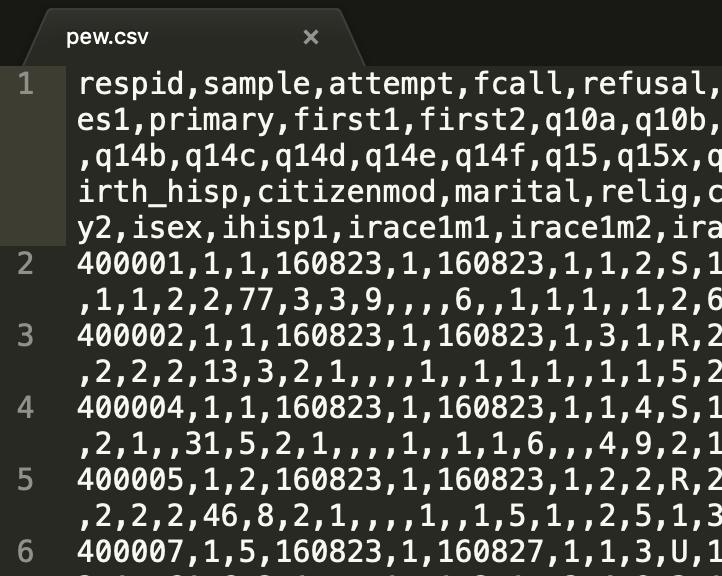
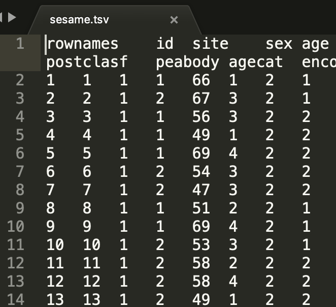

```{r setup, include = FALSE}
knitr::opts_chunk$set(
  collapse = TRUE,
  comment = "#>"
)
```

```{r include=FALSE}
# automatically create a bib database for R packages
knitr::write_bib(c(
  .packages(), 'tidyverse', 'rio'
), 'packages.bib')
```

# Importing data

The **format** and the **location** of the data are the two primary issues to consider when working to import data into R. On the format side, there are various types of formats that data can be in but they break down into two main classes: proprietary (such as SPSS (`.sav`), STATA (`.dta`), Excel (`.xlsx`), etc.) and open formats (such as comma-separated values (`.csv`), XML (`.xml`), etc.). The location of the data can be on your local machine or accessible via URL, as long as you have an internet connection during the download process R won't care where the data is located.

There are a number of R packages that have been written and contributed by R community members for reading (and writing) various data formats. In this vignette I will introduce a sort of meta package that serves as a Swiss-Army knife for data import and export: `rio` [@R-rio]. Under the hood, however, are a number of great packages that you can read more about on the [`rio` package vignette page](https://cran.r-project.org/web/packages/rio/vignettes/rio.html).

Let's load the key packages we are going to use: 

```{r libraries}
library(tidyverse) # core packages 
library(rio) # import/export 
```

Let's start by reading in some data from a URL with `rio::import()` and take a quick look at the data with `tibble::glimpse()`. Note we've provided an accessible web directory with datasets in various formats at this address: [http://users.wfu.edu/dewittme/data/sample/](http://users.wfu.edu/dewittme/data/sample/)

The first dataset is in SPSS format (`.sav`). It is from the Pew Research Center. More information on this dataset can be found here: [http://users.wfu.edu/dewittme/data/sample/aug16_nr_public/readme.txt](http://users.wfu.edu/dewittme/data/sample/aug16_nr_public/readme.txt)

```{r remote-data-gssd-sav}
# Pew Public Opinion data

pew <- import(file = "http://users.wfu.edu/dewittme/data/sample/aug16_nr_public/Aug16_nr_public.sav")

glimpse(pew)
```

Now let's import a STATA file (`.dta`). More information on this dataset can be found here: [http://www2.stat.duke.edu/~jerry/sta103/labs/lab8a.html](http://www2.stat.duke.edu/~jerry/sta103/labs/lab8a.html)

```{r remote-dta}
# Sesame Street data

sesame <- import(file = "http://users.wfu.edu/dewittme/data/sample/sesame.dta")

glimpse(sesame)
```

<!-- Note that an Excel file will often contain various 'sheets'. You will need to specify which of these sheets you would like to import.  -->

----

Local files, on the other hand, will need to specify a directory path. When you are working in R you need to keep in mind what the relative path is from the file doing the processing and the file that you want to read. To find out what R is currently considering the starting point, you can enter the following command in the Console. 

```{r getwd-path}
getwd() # find the current working directory
```

When working in an RStudio Project, the starting path will, by default, be the directory main directory of the project. That is important to keep in mind when working with R Markdown files. 

# Exporting data

After working with the data that your imported into R, you will want to save this data to disk. It is important to save this manipulated data as a different file and leave the original data as it was. This makes it a lot easier to understand what you did to the data and helps increase the reproducibility of the analysis that you conduct. Furthermore, it is often a good idea to save that data into a format that is open and more widely accessible that some of the other proprietary formats we've seen so far. A good choice is a delimited file format such as comma-separated values (`.csv`) files. `rio` being the multi-faceted package that it is makes it easy to export to various formats quite painlessly. 

Let's export our data. 

```{r}
export(pew, file = "~/Desktop/pew.csv")
export(sesame, file = "~/Desktop/sesame.tsv")
```

If you open these files in a text editor you can see the difference between these two delimited files.

```{r pew-view, echo=FALSE, out.width='50%'}

```

```{r sesame-view, echo=FALSE, out.width='50%'}

```

# References
